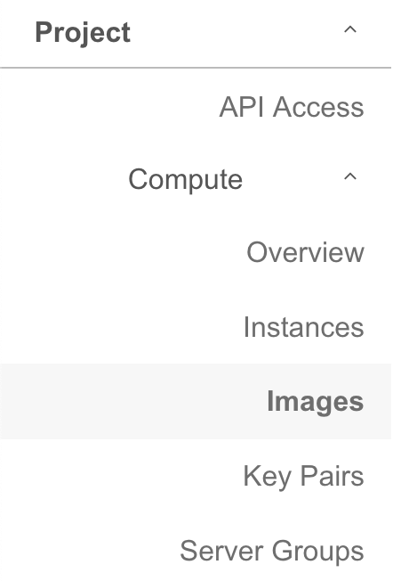
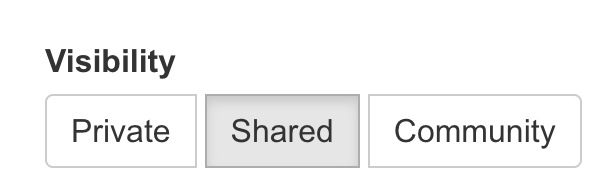

# Share an Image in Openstack

You can share an image from your project with a collaborator in a different project in OpenStack cloud so you can both launch instances using the same image.  As the owner of the image, you can revoke the sharing privilege at any time.  You can also use these methods to share an image with yourself in other projects, just think of yourself as the collaborator.

## Image Visibility Descriptions

| Visibility | Description |
| ---------- | ----------- |
| public  | Any user may read the image and its data payload.  Additionally, the image appears in the default image list of all users. **If you need your image to be public level, it will require a support request** |
| community | Any user may read the image and its data payload, but the image does not appear in the default image list of any user other than the owner. |
| shared | Only the owner and the specific image members who have been added to the image may read the image or its data payload. The image appears in the default image list of the owner. It also appears in the default image list of members who have accepted the image. Non-owners, however, will not have access to the image until they are added as image members. |
| private (**default**) | Only the owner image may read the image or its data payload. Additionally, the image appears in the owner’s default image list. |

**Prerequisites:**

- You will need to set up the OpenStack CLI to work with the project where the image to be shared is located.

    ```shell
    python3 -m venv openstackclient-env
    source openstackclient-env/bin/activate
    pip install --upgrade pip
    pip install python-openstackclient
    ```

- Source the openrc file from your openstack project. You can download it from your openstack project's dashboard by clicking on the project name in the top right. Click on the Openstack RC file from the drop down to download it.

    ```shell
    # Source your openrc file
    source <PATH_TO_YOUR_OPENRC_FILE>
    ```

- Find the ID of the target project you want to share the image with

    ```shell
    # This runs on the receiver
    openstack project list
    ```

This information can also be found via the OpenStack UI

## Share an Image With Another Project

1. Find the image ID you want to share

    ```shell
    openstack image list
    ```

1. Set the image visibility to shared

    ```shell
    openstack image set --shared <IMAGE_NAME_OR_ID>
    ```

1. Share the image with the target project

    ```shell
    openstack image add project <IMAGE_NAME_OR_ID> <TARGET_PROJECT_ID>
    ```

## Accept a Shared Image

- Source the Target Project's Credentials: The user in the target project needs to source the appropriate OpenStack credentials for their project.
- Accept the Shared Image: The target project user then accepts the shared image using its ID:

    ```sh
    # Run this on receiver's end
    openstack image set --accept <IMAGE_NAME_OR_ID>
    ```

Upon acceptance, the image will appear in the target project's image list.

## Unshare an Image (Optional)

If you would like to remove a project from having access to the image, you can do the following

- An image's owner can see which projects have access to the image:

    ```shell
    openstack image member list <IMAGE_NAME_OR_ID>
    ```

- The owner can unshare an image like this:

    ```shell
    openstack image remove project <IMAGE_NAME_OR_ID> <TARGET_PROJECT_ID>
    ```

## Share an Image With the Community (Optional)

You can also share an image with a community of users.

- To share an image with the community you need to set the visibility like this

    ```shell
    openstack image set --visibility community <IMAGE_NAME_OR_ID>
    ```

Community images do not appear in the default image lists.

- To list an image shared to the community

    ```shell
    openstack image list --community
    ```

## Share an Image Using OpensStack UI

- In the [web interface](https://cloud.rc.uab.edu) you will navigate the dropdown to Compute then select Images 

- From here locate the image you would like to share and locate the dropdown labeled `Launch` and click in to the dropdown menu there 

- In the dropdown menu select  `Edit Image` and then in the popup you will be given the choice to change the visibility 

If you need to withdraw a community image, you can change its visibility back to "private" or delete it.
